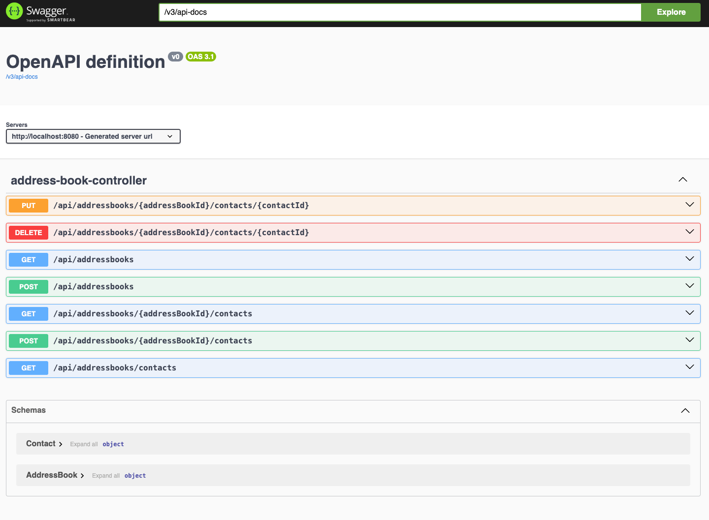
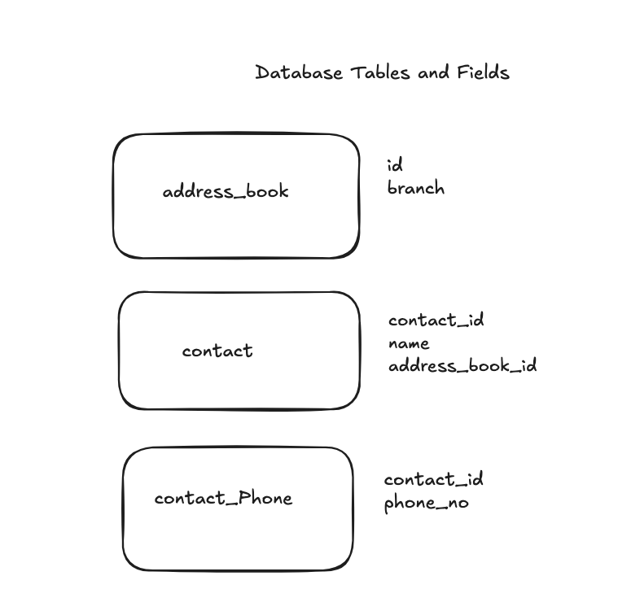
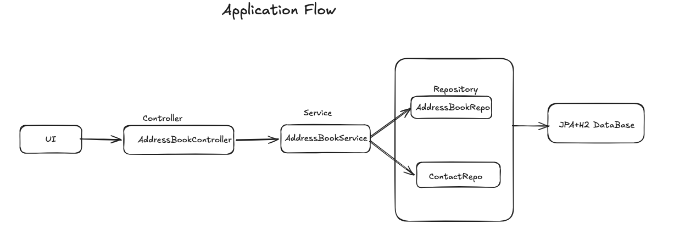

# Address Book API

A REST API that lets a Reece Branch Manager maintain multiple address books of customer
contacts — add/remove contacts, list contacts per book, and view a unique set of contacts
across all books.

## Running the project

### Option 1: Docker

```
docker compose up --build
```

### Option 2: Locally with Maven

```
./mvnw spring-boot:run
```

Once running, the app is available at `http://localhost:8080`.

## API documentation

Interactive Swagger UI, with the full API contract:

```
http://localhost:8080/swagger-ui/index.html
```

Raw OpenAPI spec:

```
http://localhost:8080/v3/api-docs
```

## Running the tests

```
./mvnw test
```

## Test API using Postman
```
Download AddressBook-postman.zip and extract them into collections folder.
```
## Screenshot





## Acceptance criteria mapping

| Requirement | Implementation |
|---|---|
| Address book holds name + phone number(s) | `Contact.name`, `Contact.phoneNo` (list) |
| Add new contact entries | `POST /api/addressbooks/{addressBookId}/contacts` |
| Remove existing contact entries | `DELETE /api/addressbooks/{addressBookId}/contacts/{contactId}` |
| Print all contacts in an address book | `GET /api/addressbooks/{addressBookId}/contacts` |
| Maintain multiple address books | `POST /api/addressbooks`, `GET /api/addressbooks` |
| Print a unique set of contacts across address books | `GET /api/addressbooks/contacts` |
| Data persistence | H2 (in-memory) via Spring Data JPA |
